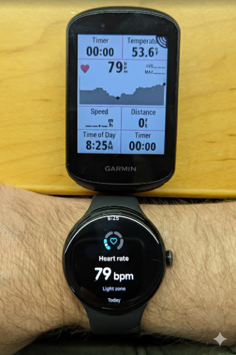
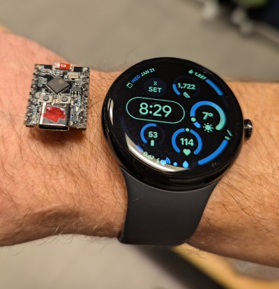

# Pixel Watch HR Rebroadcast

**Bridge your Pixel Watch 2, 3 or 4 heart rate data to bike computers, gym equipment, and apps that don't support the Watch directly.**

This project turns an **ESP32-C3** into a Bluetooth Low Energy (BLE) bridge. It connects to your Pixel Watch 3 (which encrypts its HR data) and re-broadcasts it as a standard, open Heart Rate Monitor (HRM) sensor.


 

## 🚀 Features

*   **Automatic Connection**: Scans for and bonds with your Pixel Watch 3 automatically using BLE Security.
*   **Standard Rebroadcast**: advertises as `"Pixel-HR-Repeater"` with the standard Heart Rate Service (UUID `0x180D`).
*   **Universal Compatibility**: Works with Garmin Edge, Wahoo, Zwift, Peloton, and any other device that supports standard Bluetooth Heart Rate straps.
*   **Headless Operation**: Once paired, just power it via USB (power bank or wall adapter) and it works instantly.

## Hardware Required

*   **ESP32-C3** (or any ESP32 with BLE support)
    *   *Recommended:* ESP32-C3 DevKitM-1 (Used in development)
*   **Pixel Watch 3** (or similar WearOS device)

## ⚡ Quick Install (Web)
The easiest way to install is using the **Web Installer**. No coding required!

1.  Connect your ESP32-C3 to your computer via USB.
2.  Open [this installer page](https://Raelx.github.io/Pixel-Watch-HR-Rebroadcast/web_installer/) in Chrome or Edge.
3.  Click **Connect & Install**.

## 🛠️ Manual Installation (PlatformIO)

1.  **Clone the Repo**
    ```bash
    git clone https://github.com/yourusername/Pixel-Watch-HR-Rebroadcast.git
    cd Pixel-Watch-HR-Rebroadcast
    ```

2.  **Configure Target Address (Optional)**
    *   **By default**, the device scans for **ANY** device advertising a Heart Rate Service. It will pair with the first one it finds (usually your watch if you are in pairing mode). No code changes needed!
    *   **Optional**: If you use this in a crowded gym, you can open `src/main.cpp` and set `targetDeviceAddress` to your specific Watch MAC address to prevent accidental pairing with others.

3.  **Build & Upload**
    *   This project uses [PlatformIO](https://platformio.org/).
    *   Open the project in VS Code with the PlatformIO extension.
    *   Connect your ESP32-C3 via USB.
    *   Click **Upload**.

## 📖 Usage

### 1. Connect Pixel Watch to ESP32
According to [Google's official instructions](https://support.google.com/fitbit/answer/14236705?hl=en#zippy=%2Cconnect-pixel-watch-or-to-my-fitness-equipment-or-app):
1.  On your Pixel Watch, swipe down from the clock face to access **Quick Settings**.
2.  Tap the **Connected Fitness** icon (looks like a heart with broadcast waves).
3.  Tap **Connect**.
4.  Power on the ESP32-C3. It will automatically scan and initiate a connection.
5.  On your Watch, you will see a **Pairing Request**. Tap **Checkmark / Accept**.
    *   *Note: If a code appears on the watch, just accept it. The ESP32 is headless and will auto-accept.*

### 2. Connect Your Bike/Phone to ESP32
1.  Once the ESP32 connects to the watch, it will start advertising as **"Pixel-HR-Repeater"**.
2.  Open your external device (Garmin, Wahoo, Zwift).
3.  Scan for new **Heart Rate Monitors**.
4.  Select **"Pixel-HR-Repeater"**.
5.  Success! Your real-time HR is now bridging from Watch -> ESP32 -> Your Device.

## 🔧 Technical Details

*   **Framework**: Arduino for ESP32
*   **Library**: [NimBLE-Arduino](https://github.com/h2zero/NimBLE-Arduino) (Lightweight & efficient)
*   **Mechanism**:
    *   **Client Mode**: Connects to Watch (Secure Bond), subscribes to HR Notification (`0x2A37`).
    *   **Server Mode**: Creates a local HR Service (`0x180D`) and Characteristic (`0x2A37`).
    *   **Forwarding**: When a notification is received from the watch, it is immediately written to the local characteristic and notified to any connected listeners.

## License

MIT
